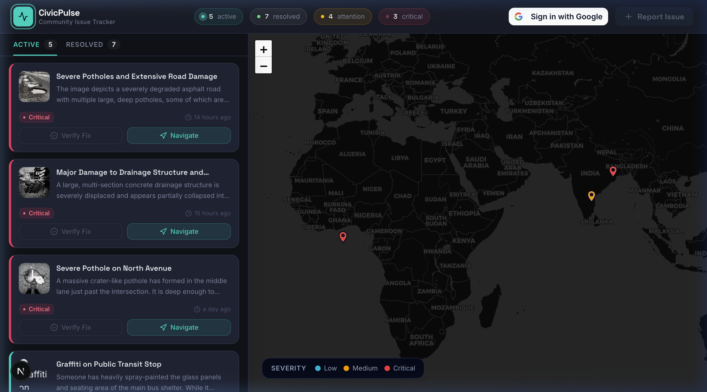

# CivicPulse — Project Replication Blueprint

This blueprint contains the complete technical specification, design system, database architecture, and AI logic required for an AI agent to perfectly replicate **CivicPulse** from scratch.

## 1. Project Overview & Mechanics
**CivicPulse** is an AI-powered community infrastructure tracking platform with an **Autonomous AI Loop**. It replaces manual civic issue reporting by having AI parse photos, classify them, score severity, and later verify their repair via user-uploaded follow-up photos. 

**The Gamification Loop**: Users earn "Civic Points" (10 pts) for successfully reporting valid issues and verifying fixes. The leaderboard/points encourage community engagement.

---

## 2. UI/UX Design System (The "CivicPulse" Theme)

### Dashboard Screenshot
Below is the exact reference UI for the dashboard:



### Design Tokens (CSS Variables)
The app uses a dark-mode-first, flat-layered aesthetic. No heavy shadows or glows, just strict color mapping.
```css
:root {
  /* Backgrounds */
  --bg-page:        #0f1117;
  --bg-surface:     #181c27;
  --bg-card:        #1e2333;
  --bg-card-hover:  #242840;

  /* Text */
  --text-primary:   #e8eaf0;
  --text-muted:     #7a8199;
  --text-dim:       #4a5068;

  /* Semantic / Severity Colors */
  --color-critical: #f43f5e; /* Rose 500 */
  --color-medium:   #f59e0b; /* Amber 500 */
  --color-low:      #2dd4bf; /* Teal 400 */
  --color-resolved: #22c55e; /* Green 500 */
  
  --color-accent:   #6366f1; /* Indigo 500 */
}
```

### Typography
- **Body (`font-sans`)**: `Inter`, weight 400.
- **Headings/Display (`font-display`)**: `Space Grotesk`, weight 600+.

### Key UI Components
- **Issue Cards**: Background `#1e2333`, Hover `#242840`. A `border-left-4` colored strip indicates severity.
- **Action Buttons**: "Verify Fix" uses ghost styling (`border-white/10`). "Navigate" uses tint styling (`bg-teal-500/12 text-teal-400`). "Report Issue" uses solid primary (`bg-teal-400 text-[#0f1117]`).
- **Micro-Animations**:
  - `dot-breathe`: Subtle scaling box-shadow for active status dots.
  - `dot-blink`: Opacity toggling for critical status dots.
  - `pulse-ring`: Expanding ring on the main logo icon.

---

## 3. Technology Stack & Architecture
- **Framework**: Next.js 15+ (App Router).
- **Styling**: Tailwind CSS + shadcn/ui.
- **Database / Auth / Storage**: Supabase.
- **AI Models**: Google Gemini (`gemini-2.5-flash` via `@google/genai` SDK).
- **Map Provider**: `react-leaflet` with CartoDB Dark Matter tiles.
- **Time Parsing**: `dayjs` for relative timestamps (e.g. "2 hours ago").

---

## 4. Database Schema (Supabase PostgreSQL)

### `reports` Table
Stores all the issue metadata extracted by the AI.
```sql
CREATE TABLE public.reports (
  id UUID DEFAULT gen_random_uuid() PRIMARY KEY,
  title TEXT NOT NULL,
  description TEXT NOT NULL,
  category TEXT NOT NULL,
  severity_score INTEGER NOT NULL, -- 1 (Low), 3 (Medium), 5 (Critical)
  status TEXT DEFAULT 'Reported',  -- 'Reported' or 'Resolved'
  latitude DOUBLE PRECISION NOT NULL,
  longitude DOUBLE PRECISION NOT NULL,
  image_url TEXT NOT NULL,
  user_id UUID REFERENCES auth.users(id),
  created_at TIMESTAMPTZ DEFAULT now(),
  updated_at TIMESTAMPTZ DEFAULT now()
);
-- RLS: Anyone can SELECT, Auth users can INSERT, Owner can DELETE, Authenticated users can UPDATE (for verification)
```

### `profiles` Table & RPCs (Gamification)
Tracks user avatars and points. Uses a Database Trigger to create rows on user signup.
```sql
CREATE TABLE public.profiles (
  id UUID PRIMARY KEY REFERENCES auth.users(id) ON DELETE CASCADE,
  civic_points INTEGER NOT NULL DEFAULT 0,
  avatar_url TEXT,
  created_at TIMESTAMPTZ NOT NULL DEFAULT now(),
  updated_at TIMESTAMPTZ NOT NULL DEFAULT now()
);

-- RPC for secure point increments
CREATE OR REPLACE FUNCTION public.increment_civic_points(user_id_param UUID, amount INT)
RETURNS void AS $$
BEGIN
  INSERT INTO public.profiles (id, civic_points, updated_at)
  VALUES (user_id_param, amount, now())
  ON CONFLICT (id) DO UPDATE
  SET civic_points = public.profiles.civic_points + amount,
      updated_at = now();
END;
$$ LANGUAGE plpgsql SECURITY DEFINER;
```

---

## 5. AI Prompt Engineering & API Configuration

The AI extraction uses Gemini's **Native Structured Outputs**.

### `responseSchema` Strategy (Zod to Gemini Object)
Do NOT rely on natural language JSON parsing. Pass `responseMimeType: "application/json"` and define the schema directly in the config.

```typescript
// Zod Schema
const ReportAnalysisSchema = z.object({
  isAuthentic: z.boolean().describe("True if authentic civic issue..."),
  fraudReason: z.string().nullable(),
  title: z.string(),
  description: z.string(),
  severity: z.enum(["Low", "Medium", "Critical"]),
  category: z.string(),
});
```

### System Instructions: `/api/report`
```text
You are the primary City Infrastructure Triage Gate. Determine if this image contains a reportable civic defect (e.g., pothole, graffiti). You are a digital forensics expert. You must reject this image if it appears to be a downloaded stock photo, contains watermarks, shows computer screen pixels (moiré effect), or lacks physical realism. Return ONLY a valid JSON object matching the requested schema.
```

### System Instructions: `/api/verify` (The Autonomous Verification Loop)
This route receives the *original* report image and the *newly uploaded* verification image side-by-side.
```text
You are a City Infrastructure Verification AI. You will receive two images: 
1. The ORIGINAL issue.
2. The NEW verification photo.
Determine if the issue shown in the original image has been satisfactorily resolved in the new image (e.g. pothole filled, graffiti painted over). If it is resolved, return is_resolved: true.
Return a valid JSON object with boolean `is_resolved` and a string `reasoning`.
```
> [!IMPORTANT]
> The `/api/verify` route also validates GPS proximity mathematically before allowing the AI check, ensuring the user is physically at the location of the report.

---

## 6. Critical Performance Engineering Patterns

When replicating the React UI, you MUST implement these strict performance patterns to prevent map flickering and API rate limiting:

1. **Synchronous Submission Locking (`useRef`)**:
   Do not rely solely on `useState` for locking form submissions. React batches state asynchronously, leading to double API firing on fast double-clicks. Use a `const isSubmittingRef = useRef(false);` guard at the top of submit handlers.
2. **Event Listener Memory Leaks**:
   When using custom window events (like `window.dispatchEvent(new CustomEvent("civicPointsUpdate"))`), the listener MUST be wrapped in a `useEffect` with an empty dependency array and a strict `return () => window.removeEventListener(...)` cleanup function.
3. **Map Re-Renders**:
   Extract Leaflet Map components to a separate `memo`ized file. Do not inline Leaflet `<MapContainer>` directly inside a state-heavy `page.tsx`, or any state update (like opening a modal) will cause the map tiles to completely unmount and flicker.
4. **Resilient AI Calling (Exponential Backoff)**:
   Implement a `withGeminiRetry` wrapper that intercepts `429 Too Many Requests` and `503 Service Unavailable` from Google. Wait, jitter, and retry up to 3 times before failing to the frontend.

---

## 7. Project File Structure

Below is the complete file tree of the CivicPulse project:

```text
.
├── app
│   ├── api
│   │   ├── report
│   │   │   ├── [id]/route.ts
│   │   │   └── route.ts
│   │   ├── reports/route.ts
│   │   └── verify/route.ts
│   ├── dashboard/page.tsx
│   ├── globals.css
│   ├── layout.tsx
│   ├── page.tsx
│   └── favicon.ico
├── components
│   ├── ui
│   │   ├── CooldownSubmitButton.tsx
│   │   ├── LoginButton.tsx
│   │   ├── button.tsx
│   │   ├── card.tsx
│   │   ├── dialog.tsx
│   │   ├── input.tsx
│   │   └── label.tsx
│   ├── LeafletMap.tsx
│   ├── SeverityBadge.tsx
│   └── Toast.tsx
├── lib
│   ├── gemini.ts
│   ├── supabase.ts
│   └── utils.ts
├── supabase
│   └── migrations
│       ├── 001_initial_schema.sql
│       ├── 002_add_update_policy.sql
│       ├── 003_gamification_schema.sql
│       ├── 004_add_user_id_to_reports.sql
│       └── 005_fix_delete_policy.sql
├── utils
│   └── supabase
│       ├── client.ts
│       └── server.ts
├── public
├── .env.example
├── .env.local
├── .dockerignore
├── Dockerfile
├── next.config.ts
├── package.json
└── README.md
```
